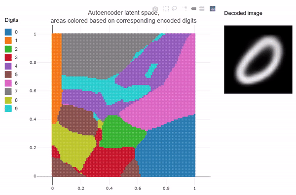

# Latent space exploration

This repository aims to be a pedagogical tool for understanding how neural networks intermediate layers treat the input data in the so-called *latent space.*  

It was inspired by N8python's work: [github.com/N8python/mnistLatentSpace](https://github.com/N8python/mnistLatentSpace)  

**[Try out the latent space visualization application.](https://jexbrayat.github.io/latent_space_exploration/)**  
I advise not to dive into the code but rather read the abstract and the docs.

## Abstract

*A latent space, also known as a latent feature space or embedding space, is an embedding of a set of items within a manifold in which items resembling each other are positioned closer to one another* - Wikipedia, Latent space.  

How many dimensions can a latent space have? To what extent can we reduce the dimensionality while preserving the information? How sparse can a latent space be if it is unbounded? How can we ensure that similar input data are encoded closely in the embedded space?

This project addresses these questions by exploring various autoencoder architectures to embed the MNIST digits dataset into a two-dimensional latent space.

The following tasks were performed to produce the visualization application:  
1) Train an autoencoder on the MNIST digits dataset featuring a two-dimensional latent space layer.  
2) Retrieve the bounds of the latent space.
3) Create a meshgrid within the bounded latent space.
4) Decode all meshgrid data points using the decoder part of the autoencoder.
5) Predict the class of each decoded meshgrid data point with a classifier trained on MNIST.
6) Color the meshgrid based on the predicted class of each grid point.

The selected autoencoder architecture features a variational layer and a customized loss penalized by a Kullback-Leibler divergence term. This enforces the digits of the same class to form a Gaussian shape in the latent space and smooths the borders.

## Visualize the latent space through training epochs

I was curious to see how many epochs were necessary for the latent space to become coherent.  
This curiosity led to the following gif which I find nice to watch: 

